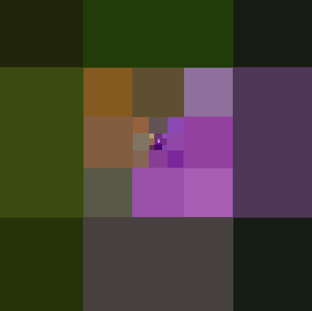
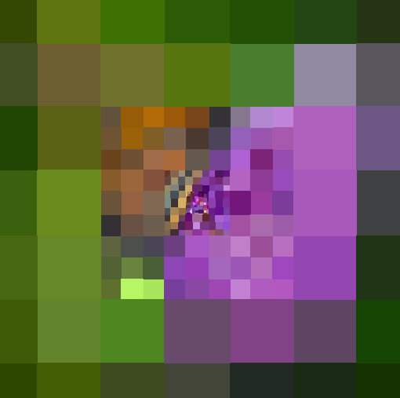

# Foveated-Rendering
(Folder incorrectly labeled "Depth_of_Field", should be "Foveated_Rendering")

Implemented in C++ & CUDA

**Video Demonstration:**
https://youtu.be/7tBCs7AYMPg

**Original Image**:

In the first five images, the fovea is located at the center of the image.
|  |  |  |
| --- | --- | -- |
| Magnification 1| Magnification 2| Magnification 3 |

|  |  |  |
| --- | --- | --- |
| Magnification 4| Magnification 5| Magnification 5 but Fovea is at Top Left Corner |